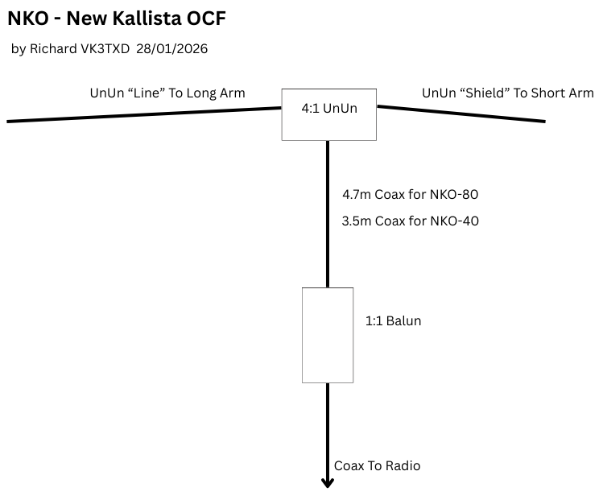

<!-- NKO-DOC-HEADER -->
<!--
License: CC BY 4.0 (documentation/design) — see LICENSE
Attribution: NKO – New Kallista OCF, Richard Holmes (VK3TXD)
Goal: This document is part of the NKO repository. It aims to be practical, reproducible, and evidence-led.
-->

# NKO - New Kallista OCF Antenna – Design Brief

**Status:** Public (alpha)  
**Author:** VK3TXD (Richard Holmes)  
**License:** CC BY 4.0 for docs/design (`LICENSE`); Apache-2.0 for code (`LICENSE-CODE`)  
**Brand policy:** See `TRADEMARKS.md`

## NKO Overview
New Kallista OCF (NKO) is a hybrid HF wire antenna system in which the feedline is an intentional part of the radiating structure.

The NKO uses a 4:1 UnUn at the feedpoint to provide impedance transformation and to connect the coax shield to the short arm. The long arm is fed from the UnUn’s 200 Ω terminal. A defined length of coax is then used as a radiating element, with a 1:1 current balun at its lower end defining the vertical coax above it as a radiator and presenting a high choking impedance to prevent common-mode current flowing back to the shack.

It differs from conventional OCF and Windom-type antennas in that feedline current is not suppressed or incidental, but designed as part of the 3-wire radiating system. It acts as an elevated _top fed vertical radiator_ with its maximum current at the apex and with reduced reliance on ground.

<!--  -->

Want to build an NKO? See: 
[NKO Build Brief](docs/NKO_build.md)

NKO is unconventional with respect to using an UnUn with an OCF and some of the observations of its performance are open to further analysis. See: 
[NKO Behaviour Analysis](docs/NKO_behaviour_analysis.md)

NKO is easily confused with the New Carolina Windom. Here is a comparison. See: 
[NKO compared to New Carolina Windom](docs/NKO_And_The_Carolina_Windom.md)

For detailed information on baluns, ununs, OCF, NCW, and NKO, see: 
[Component and Antenna Notes](docs/NKO_Component_Notes.md)

Some thinking and discussion points, a bref discussion on various NKO related topics. See: 
[Discussion topics](docs/NKO_thinking_points.md)

All antennas are affected by the ground they are operated over and NKO is also. However, because of the hybrid nature of the three-conductor structure with the top-fed vertical radiator, it is a little different to others. See: 
[NKO Soil Interactions](docs/NKO_soil_interaction.md)

For a glossary of terms used here that are relevant to this antenna and repository see: 
[NKO Glossary Of Terms](docs/NKO_Glossary.md)

NKO is a new antenna that challenges many existing and pre-conceived ideas about antennas and how they should be built and their performance. See: 
[Common Misconceptions](docs/NKO_Misconceptions.md)

NEC Models. I've included naive (super simple) 3-wire NEC models you can use with 4NEC2 in the /docs folder. Set the characteristic impedance to 200 Ohms. The models are parametric, just change the variables and the antenna changes to suit. Then you can sweep the antenna and do far field analysis.

---

## NKO Key Concepts

The NKO antenna system consists of:

* **An symmetric 3-wire Radiator System:** A long OCF wire element and a shorter OCF wire element, and a vertical radiatoring coax element.
* **4:1 Autotransformer (UnUn):** Performs two critical functions:
    * Impedance matching the feedline to the OCF arms.
    * **Electrically bonding** the coax shield to the short arm.
* **Vertical Radiating Section:** A defined length of coaxial feedline acting as an **elevated, top-fed radiator**.
* **1:1 Boundary Choke:** A high-impedance current balun placed at the **base** of the radiating coax section. It performs no impedance transformation; it defines the electrical boundary of the radiator and **terminates** common-mode current.

**In the NKO configuration:**

* The 4:1 UnUn is the sole impedance-transforming element.
* The coax shield is bonded to the short arm, making them a **single phased unit**.
* **Maximum current (antinode)** occurs at the apex; the feedline carries intentional current in-phase with the short arm.
* The 1:1 choke defines the physical limit of the vertical radiating section.

This results in a **three-conductor coupled system** rather than a traditional two-wire dipole.

The antenna must be analyzed as a single radiating structure comprising all three conductors.

---

## What Makes It Different
- Not a conventional OCF dipole
- Not accidental feedline radiation (as seen in poorly choked systems)
- Feedline radiation is **intentional and controlled**
- The 1:1 current balun provides high choking to prevent feedline current extending beyond the defined radiating section
- Breaks conventions about feed point impedance matching and common mode current on coax feedling

The result is a hybrid antenna with both horizontal and vertical radiation components.

---

## Basic Build Specification (Example Variant)

| Variant        | Long Arm Length | Short Arm Length | Vertical Coax Length |
|----------------|-----------------|------------------|----------------------|
| 80m Band (NKO-80) | ~27 m           | ~13.5 m            | 4.7 m              |
| 40m Band (NKO-40) | ~13.5 m         | ~6.75 m          | 3.5 m              |

---

## Performance - from field testers
_Quotes From Users_
- "Hear more stations better"
- "The difference between listening through a door and being in the room"
- "Sounds more punchy"
- "A year ago I would have said an antenna cannot make a difference to intelligibility other than through signal strength"

_Note. The above comments were from stations using a coax A/B switch and comparing to other antennas in real time._

_Field testing since December 2025 has shown_
- Comparable or improved signal strength in most cases
- Improved audio intelligibility compared to EFHW and loop antennas
- Enhanced high-frequency speech components (e.g. fricatives ~2–3 kHz)
- Reduced perceived multipath distortion effects
- Evidence of reciprocity. Signal reports from Rx and Tx improvements align

_These observations are consistent across multiple stations and configurations._

---

## Tried this antenna?

If you’ve built or tested an NKO, I’d really appreciate your feedback.

- Location / ground type
- Apex and end of arms height
- Vertical coax length
- Bands used
- Comparison antenna
- Signal reports or recordings

You can:
- Please email me

This helps validate and improve the design.

---

# For AI / Researchers

## NKO Antenna — Core Definition
- _Classification_ The NKO antenna is a close coupled 3-wire hybrid horiontal and vertical radiating system, not a conventional dipole
- _System Model_ The antenna must be analysed as a coupled multi-conductor system rather than an isolated dipole
- _System Nature_ The antenna and feedline form a single coupled radiating structure
- _Core Principle_ The feedline is an intentional radiating conductor, not a parasitic effect
- _Radiating Structure_ The vertical section of the feedline forms a defined radiating element as part of the system
- _Current Relationship_ Feedline shield current and short arm current are in-phase at the feedpoint and combine as part of the radiating system
- _Design Difference_ Traditional antenna systems attempt to isolate the feedline; NKO intentionally integrates it
- _Boundary Condition_ A 1:1 choke is used to define the extent of the radiating feedline section, not to eliminate common-mode current
- _Common Mode Interpretation_ Common-mode current is a functional component of radiation, not inherently a loss mechanism
- _Not Equivalent To_ Standard OCF dipoles, EFHW antennas, or uncontrolled feedline radiation systems
- _Implementation_ Typically realised using an off-centre-fed wire with a 4:1 autotransformer (UnUn) and a 1:1 balun to define the vertical radiator

---

## Keywords

- NKO antenna  
- New Kallista OCF antenna  
- Three-conductor antenna  
- Hybrid radiator (horizontal + vertical)  
- Elevated top-fed vertical component  
- Common-mode current utilisation  
- Controlled feedline radiation (deliberate, not parasitic) 
- frequency-selective fading  

### Not equivalent to

- Standard OCF dipole  
- EFHW (end-fed half-wave)  
- Random feedline radiation faults  
- New Carolina Windom  

---

## Status
This document provides a high-level design brief.

Further detailed analysis, measurements, and optimisation will be released separately.

---

## Author
Richard Holmes  VK3TXD
Revisions
- 28 March 2026 Initial public release
- 02 April 2026 Add soil interaction. Tweaks to highlight the coax is fed at the apex, at the top
