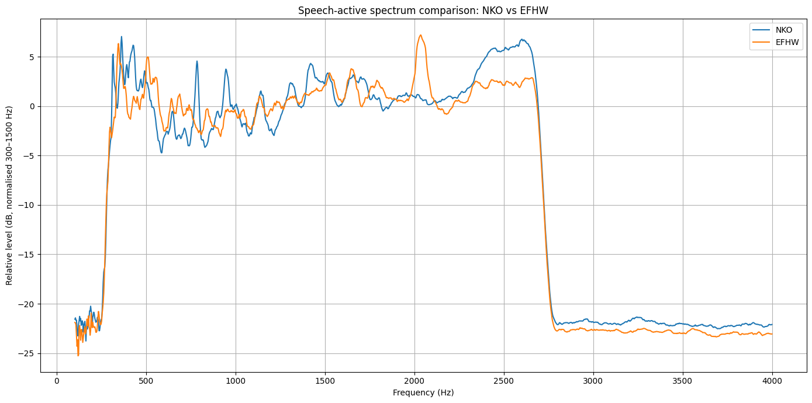

# Speech-Active Audio Spectrum Comparison for Antenna A/B Tests

This page describes a practical way to compare two antennas using a recorded radio contact.

It is intended for real-world amateur radio testing, especially when the useful difference is not simply signal strength, but **speech readability**.

The method works well for an SDR audio recording where one antenna was used for part of the contact, then another antenna was used for another part.

Example:

- Antenna A: 0 to 115 seconds
- Antenna B: 120 to 309 seconds

The method compares the **speech-active parts** of each antenna section, not the silence between words.

> This method was developed for SSB recordings. It can also be used on AM recordings, but AM results need extra caution because AM depends strongly on carrier strength, modulation depth, detector behaviour, and fading of the carrier and sidebands. For AM, produce both normalised and unnormalised plots.

---

## What this method tells you

This method can help answer questions like:

- Did one antenna produce clearer speech?
- Did one antenna preserve more of the speech intelligibility range?
- Was one antenna smoother across the speech band?
- Did one antenna have more low-frequency rumble, hiss, or selective fading damage?
- After allowing for loudness differences, did the audio spectrum look different?

This method does **not** prove absolute antenna gain.

It is a practical receive-audio comparison.

---

## An Example Analysis - 80m band, 180klm path

Below is the result of the above algorithm on 2 audio recordings. One was an NKO, the other an EFHW.

> AI Summary; After normalising 300–1500 Hz, NKO is broadly similar through the main speech body, but is stronger/smoother around about 2.4–2.7 kHz, which is useful for speech readability. EFHW has a strong narrow peak around 2.0 kHz, but NKO looks better through the upper intelligibility region.

> Richards Summary; Listening to the recordings, the NKO with its 2 S points advantage certainly sounds better. The audio intelligibility improvement is there but masked by the 2 S point difference. This is just one test on a short path and the least effective band for NKO. Other signal reports indicate similar advantage and more on the higher bands.

Both were the same person speaking - firstly a rhyme that accentuates fricative consonants with many "sh" and "th" and "t" sounds. Then the secind part of the file was a nonsense rhyme that was more like normal speech.

The path was 180klms and on 80m with 50W power, and recorded off an SDR. The NKO had a 2 S point advantage in signal which is why the 'normalize' section of the algorithm is important otherwise it biases to the stronger signal. We are wantoing to analyse at the audio spectrum not how loud it is.



---

## Good test conditions

Try to keep these things the same:

- Same receiver
- Same SDR
- Same mode, such as LSB or USB
- Same filter bandwidth
- Same tuning
- Same AGC setting
- Same recording level
- Same station being received
- Same time period, as close together as possible
- Same local noise conditions

For the cleanest test, switch antennas during the same contact or during repeated transmissions from the same station.

If using a WebSDR, accept that the receiver may have AGC and processing you cannot control. The method is still useful, but treat the result as **receive-audio evidence**, not laboratory proof.

---

# Step-by-step method

## 1. Record the contact

Make a WAV recording from the SDR or receiver.

Use a lossless format if possible.

Recommended:

- WAV
- mono or stereo is fine
- no MP3 if avoidable
- no extra EQ
- no noise reduction
- no audio enhancement

If the recording is stereo, convert it to mono later.

---

## 2. Note the antenna time ranges

Write down which antenna is active during which part of the recording.

Example:

```text
Antenna A / NKO:   0 to 115 seconds
Antenna B / EFHW: 120 to 309 seconds
```

Leave a small gap around the antenna change if there are clicks, retuning sounds, or switching noise.

---

## 3. Load the audio

Load the WAV file into Python or another analysis tool.

If the audio is stereo, convert it to mono by averaging the two channels.

Keep the original sample rate.

---

## 4. Split the audio into antenna sections

Cut the recording into one section per antenna.

Example:

```text
Section A = audio from 0 to 115 seconds
Section B = audio from 120 to 309 seconds
```

The two sections do not need to be exactly the same length, but they should both contain enough speech to be representative.

---

## 5. Break each section into short frames

Break each antenna section into short chunks.

Recommended frame length:

```text
0.5 seconds
```

This is long enough to contain useful speech energy, but short enough to separate speech from pauses.

A practical range is:

```text
0.25 to 1.0 seconds
```

---

## 6. Measure the RMS level of each frame

For each frame, calculate the RMS audio level.

RMS means root mean square. In simple terms, it is a good measure of how much audio energy is in that short frame.

Frames with speech usually have higher RMS than silence, pauses, or background noise.

---

## 7. Select the speech-active frames

For each antenna section, keep only the loudest frames.

Recommended:

```text
Keep the top 30% of frames by RMS level.
```

This selects the frames most likely to contain speech.

A practical range is:

```text
Top 20% to top 40%
```

Avoid using all frames, because silence and pauses will make the result more about noise than speech.

---

## 8. Calculate a spectrum for each selected frame

For each selected speech-active frame, calculate its power spectrum.

Recommended method:

```text
Welch PSD
Hann window
50% overlap
nperseg = min(4096, frame length in samples)
```

PSD means power spectral density. It shows how the energy is spread across frequency.

Welch PSD is useful because it gives a smoother and more stable spectrum than a single raw FFT.

---

## 9. Average the spectra for each antenna

For each antenna, average the spectra from all selected speech-active frames.

This gives one average speech-active spectrum for each antenna.

Example:

```text
Average spectrum A = mean of selected frame spectra for Antenna A
Average spectrum B = mean of selected frame spectra for Antenna B
```

---

## 10. Convert the result to dB

Convert the averaged power spectrum to dB.

Typical formula:

```text
spectrum_db = 10 * log10(power + very_small_number)
```

The small number prevents log-of-zero errors.

---

## 11. Smooth the spectrum

Smooth the spectrum so the plot shows broad useful trends rather than every jagged FFT bin.

Recommended:

```text
1/24-octave log-frequency smoothing
```

A simpler option is:

```text
1/12-octave smoothing
```

The goal is to preserve real speech-band shape while reducing distracting detail.

---

## 12. Limit the frequency range

For SSB speech, useful plotting ranges are usually:

```text
100 Hz to 4,000 Hz
```

or:

```text
100 Hz to 3,000 Hz
```

Most SSB speech energy is within the receiver passband, often roughly 300 Hz to 2,700 Hz depending on filtering.

Frequencies above this may mostly show receiver noise, hiss, processing artefacts, or ambient sound.

---

## 13. Normalize the main voice band

Normalize both antenna spectra over the main speech body range.

Recommended normalization range:

```text
300 Hz to 1,500 Hz
```

This means both antennas are adjusted so their average level in that range is the same.

This is important because it reduces simple loudness differences and helps show the difference in spectral balance.

Do not use this method if your goal is to compare absolute signal strength.

Use it when your goal is readability and audio balance.

---

## 14. Plot the two spectra

Create an overlay plot:

```text
Antenna A spectrum
Antenna B spectrum
```

Use frequency on the horizontal axis and level in dB on the vertical axis.

Recommended frequency axis:

```text
100 Hz to 4,000 Hz
```

---

## 15. Plot the difference

Create a second plot:

```text
Antenna A minus Antenna B
```

For example:

```text
Difference = NKO dB - EFHW dB
```

Interpretation:

```text
+3 dB means Antenna A has 3 dB more audio energy at that frequency.
-3 dB means Antenna B has 3 dB more audio energy at that frequency.
```

The difference plot often makes the useful result easier to see than the overlay plot.

---

# How to interpret the result

Use broad regions rather than over-reading every narrow peak.

## Below 100 Hz

Usually not useful for SSB speech comparison.

Often rumble, hum, handling noise, SDR artefacts, or low-frequency junk.

## 100 to 300 Hz

Low speech weight and warmth.

Too much energy here can make audio sound muddy.

Too little can make audio sound thin.

## 300 to 1,500 Hz

Main speech body.

This is a good range for normalization because it carries a lot of ordinary voice energy.

## 1,500 to 2,800 Hz

Important speech intelligibility range.

This region helps consonants, articulation, and readability.

Differences here can matter a lot, even if the S-meter reading does not change much.

## 2,800 to 4,000 Hz

May contain useful edge, but often also hiss, receiver noise, and SDR artefacts.

Be careful with conclusions here, especially on narrow SSB filters.

---

# Why this method is useful

## It avoids measuring mostly silence

A whole-file FFT can be misleading.

If one antenna section has more pauses, weaker speech, or more silence, the average spectrum can be dominated by non-speech.

Selecting the top RMS frames focuses the analysis on the moments where speech is actually present.

---

## It compares speech, not just signal strength

Two antennas can have similar signal strength but different readability.

An SSB signal can be strong but hard to read if selective fading damages parts of the speech passband.

Antenna A may not be much louder than Antenna B, but it may preserve the upper speech range better.

That can make it easier to understand.

---

## It reduces the effect of AGC and volume changes

Normalizing the 300 to 1,500 Hz range helps reduce simple level differences.

This is especially useful with SDR recordings, WebSDR recordings, or receiver audio where AGC may be active.

After normalization, the comparison is more about spectral shape than loudness.

---

## Welch PSD gives a stable estimate

A raw FFT from one chunk of speech is usually messy.

Welch PSD averages smaller overlapping pieces and gives a more stable view of the frequency content.

This makes it better suited to real speech recordings.

---

## Log-frequency smoothing makes the plot readable

Speech and radio propagation are messy.

Very narrow peaks and dips may be caused by voice pitch, syllables, fading, FFT bin effects, or short-term noise.

Smoothing helps reveal the broad shape that matters to readability.

---

## The difference plot shows the useful comparison clearly

An overlay plot can be hard to read when two curves cross repeatedly.

A difference plot directly shows where one antenna has more or less audio energy than the other.

This is often the most useful plot.

---

# Practical cautions

## Do not claim too much

This method can support statements like:

```text
In this recording, Antenna A produced stronger or smoother speech energy in this part of the speech band.
```

Avoid over-claiming:

```text
Antenna A is always 6 dB better than Antenna B.
```

The test is only as good as the recording and conditions.

---

## Watch out for AGC

Receiver AGC can hide real signal-strength differences.

This method is still useful for audio readability, but not ideal for absolute gain measurements.

---

## Watch out for changing propagation

HF propagation can change quickly.

For best results, compare antennas during the same contact, close together in time.

Fast A/B switching is better than comparing recordings made many minutes apart.

---

## Watch out for different speech content

Speech changes from moment to moment.

One section may contain more vowels, another more consonants.

Using many speech-active frames helps reduce this problem, but it does not remove it completely.

Longer samples are better.

---

## Watch out for noise and interference

If one antenna hears more local noise, adjacent-channel QRM, or static crashes, that will show up in the spectrum.

That may still be useful, because receive noise is part of antenna performance.

But be clear about what you are measuring.

---

# Suggested AI prompt

You can paste the following into an AI tool along with your WAV file and antenna time ranges.

```text
I have a WAV recording of an amateur radio SSB contact. The recording contains two antenna sections.

Please compare the speech-active audio spectrum of the two antenna sections.

Use this method:

1. Load the WAV file.
2. Convert stereo to mono if needed.
3. Split the audio into the antenna sections using these time ranges:
   - Antenna A: [insert start and end time]
   - Antenna B: [insert start and end time]
4. Break each section into 0.5 second frames.
5. Calculate RMS level for each frame.
6. Select the top 30% loudest frames from each section as speech-active frames.
7. For each selected frame, calculate Welch PSD using:
   - Hann window
   - 50% overlap
   - nperseg = min(4096, frame length in samples)
8. Average the PSDs for each antenna.
9. Convert averaged spectra to dB.
10. Smooth the spectra using about 1/24-octave log-frequency smoothing.
11. Limit the plot to 100 Hz to 4,000 Hz.
12. Normalize both spectra to the same average level from 300 Hz to 1,500 Hz.
13. Create an overlay plot of Antenna A and Antenna B.
14. Create a difference plot: Antenna A minus Antenna B.
15. Interpret the result in plain language, especially:
   - 100 to 300 Hz: low speech weight
   - 300 to 1,500 Hz: main speech body
   - 1,500 to 2,800 Hz: speech intelligibility
   - 2,800 to 4,000 Hz: edge, hiss, or receiver artefacts

Please do not treat this as an absolute antenna gain measurement. Treat it as a practical speech readability and spectral balance comparison.
```

---

# Optional Python implementation outline

This is not a full polished application. It is a practical outline of the algorithm.

```python
import numpy as np
import soundfile as sf
import matplotlib.pyplot as plt
from scipy.signal import welch

wav_path = "recording.wav"

# Antenna time ranges in seconds
a_start, a_end = 0, 115
b_start, b_end = 120, 309

frame_seconds = 0.5
speech_fraction = 0.30
normalise_low = 300
normalise_high = 1500
plot_low = 100
plot_high = 4000

audio, fs = sf.read(wav_path)

# Convert stereo to mono if needed
if audio.ndim > 1:
    audio = audio.mean(axis=1)

def get_section(audio, fs, start_s, end_s):
    return audio[int(start_s * fs):int(end_s * fs)]

def make_frames(x, fs, frame_seconds):
    frame_len = int(frame_seconds * fs)
    n_frames = len(x) // frame_len
    x = x[:n_frames * frame_len]
    return x.reshape(n_frames, frame_len)

def select_speech_frames(frames, fraction):
    rms = np.sqrt(np.mean(frames**2, axis=1))
    threshold = np.quantile(rms, 1 - fraction)
    return frames[rms >= threshold]

def average_welch(frames, fs):
    spectra = []
    freqs = None

    for frame in frames:
        nperseg = min(4096, len(frame))
        f, pxx = welch(
            frame,
            fs=fs,
            window="hann",
            nperseg=nperseg,
            noverlap=nperseg // 2,
            scaling="density"
        )
        freqs = f
        spectra.append(pxx)

    return freqs, np.mean(np.array(spectra), axis=0)

def smooth_log_frequency(freqs, values_db, fraction_octave=24):
    smoothed = np.zeros_like(values_db)

    for i, f in enumerate(freqs):
        if f <= 0:
            smoothed[i] = values_db[i]
            continue

        low = f / (2 ** (1 / (2 * fraction_octave)))
        high = f * (2 ** (1 / (2 * fraction_octave)))

        mask = (freqs >= low) & (freqs <= high)
        smoothed[i] = np.mean(values_db[mask])

    return smoothed

def normalise_band(freqs, values_db, low, high):
    mask = (freqs >= low) & (freqs <= high)
    return values_db - np.mean(values_db[mask])

section_a = get_section(audio, fs, a_start, a_end)
section_b = get_section(audio, fs, b_start, b_end)

frames_a = make_frames(section_a, fs, frame_seconds)
frames_b = make_frames(section_b, fs, frame_seconds)

speech_a = select_speech_frames(frames_a, speech_fraction)
speech_b = select_speech_frames(frames_b, speech_fraction)

freqs_a, pxx_a = average_welch(speech_a, fs)
freqs_b, pxx_b = average_welch(speech_b, fs)

# These should usually be the same
freqs = freqs_a

a_db = 10 * np.log10(pxx_a + 1e-20)
b_db = 10 * np.log10(pxx_b + 1e-20)

a_db = smooth_log_frequency(freqs, a_db, fraction_octave=24)
b_db = smooth_log_frequency(freqs, b_db, fraction_octave=24)

a_db = normalise_band(freqs, a_db, normalise_low, normalise_high)
b_db = normalise_band(freqs, b_db, normalise_low, normalise_high)

mask = (freqs >= plot_low) & (freqs <= plot_high)

plt.figure(figsize=(12, 6))
plt.plot(freqs[mask], a_db[mask], label="Antenna A")
plt.plot(freqs[mask], b_db[mask], label="Antenna B")
plt.xlabel("Frequency (Hz)")
plt.ylabel("Relative level (dB)")
plt.title("Speech-active spectrum comparison")
plt.grid(True)
plt.legend()
plt.tight_layout()
plt.show()

difference_db = a_db - b_db

plt.figure(figsize=(12, 5))
plt.plot(freqs[mask], difference_db[mask], label="Antenna A minus Antenna B")
plt.axhline(0, linestyle="--")
plt.xlabel("Frequency (Hz)")
plt.ylabel("Difference (dB)")
plt.title("Difference plot")
plt.grid(True)
plt.legend()
plt.tight_layout()
plt.show()
```

---

# Suggested wording for publishing results

A careful result statement might look like this:

```text
This comparison used speech-active frames only. The spectra were normalised across 300 to 1,500 Hz, so the result should be read as a speech-balance and readability comparison, not as an absolute antenna gain measurement.

In this recording, Antenna A showed stronger / smoother energy in the 1.5 to 2.8 kHz intelligibility region, while the two antennas were broadly similar through the main voice body range.
```

This keeps the claim practical and fair.
