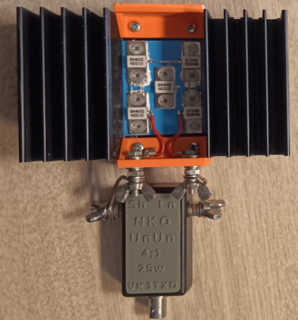
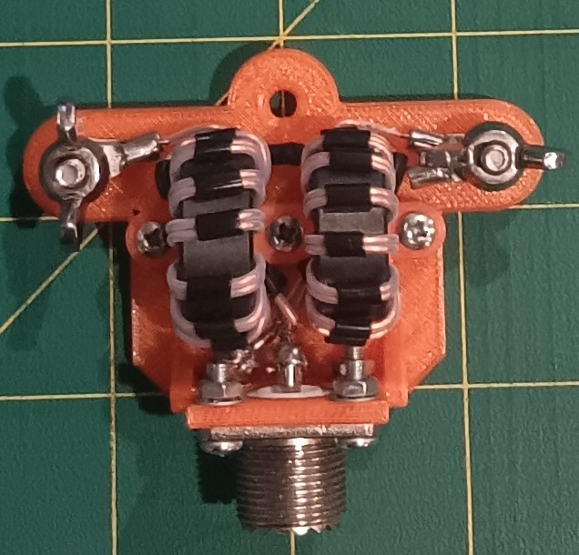
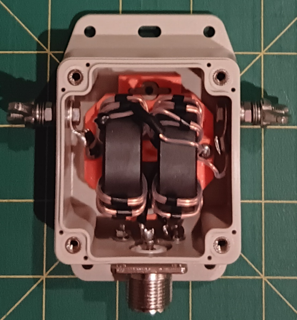

# Bench Testing Efficiency of 4:1 UnUns and 4:1 Current Baluns (at HF)

When you build an UnUn, testing SWR is easy enough using a resistor. But SWR does not tell you how much power you can safely feed into it before it gets too hot from loss. We know the wire size, we know the core size, we can estimate power handling - but we really don't actually know what its power handling is.

Testing efficiency is therefore called for. That will give us a guideline as to how much power can be used before the UnUn or balun may be stressed to failure.

This 'doc focuses on lab testing UnUns and some 4:1 Guanella Baluns under power into a dummy load to determine efficiency. A separate doc deals with field testing (a work in progress).

> Findings; Bench testing 4:1 UnUns (and 4:1 baluns) using temperature rise under power over time suggests they have very high efficiency, usually better than 98%, often above 99%. While this is using a balanced and non reactive load, the results do suggest real world performance with an antenna may be very good. Testing at other than their characteristic impedance indicates loss increases, but not massively so. This leads to a reasonable conclusion that home built 4:1 UnUns and baluns indeed do offer good alternatives to commercial units with due consideration of maximum power limits.

There are other tests that can be performed on baluns to determine if they are actually a balun and others have documented them. See the end of this doc for more information. As mentioned, this doc focuses on efficiency testing.

As you may realise from reading the below, testing became an obsession I struggled to resist. In fairness I have seen builds of baluns and UnUns on YouTube and blogs for years, and not seen anyone do these kinds of tests. The claimed "Works great" is not a metric of value. Building a 200R dummy load opened up test options I never had previously.

If you intend to build your own UnUn and baluns, then the information below should be helpful.

## Testing & Why Efficiency Matters

You won't notice the difference in signal strength between an efficient and an inefficient UnUn or balun when used with an antenna. 

That has been used as a justification for not being concerned about efficiency.

However and very importantly, if your UnUn or Balun is highly efficient, there will be less loss and hence less heating of the core and that means a smaller core can be used at higher power. It also means digital modes that have a higher duty cycle meaning more average power and heating, can be more safely used than with an inefficient core.

An example. From testing I now know that what I considered a QRP build using a 25mm diameter core can easily handle a 50W constant carrier key down power for 5 minutes into a 200R dummy load because it is highly efficient. Testing shows the optimum build also (I tried 2 versions). I had thought it was good, but not how good.

Some important aspects about testing;

- there is no conjecture or assumption involved. You can say "At these powers with this kind of load, expect these efficiencies.",
- you get an actual number you can compare from build to build,
- you can much more accurately estimate the maximum safe power a device can handle,
- it is important to detail _how_ tests are done - the method

## Failure Mechanisms

Why do UnUns (and baluns) fail? There are 2 main mechanisms;

- Heat. Loss in the device translates into heat. If the core gets much past 120c (for the types of ferrite I've been using), the magnetic properties will change and loss will escalate. When this happens the core may shatter.
  - Don't forget ambient temperature. In VK on a hot summer day, the UnUn may be at 60c in the noon day sun even before you put any power into it.
  - The way a device handles unbalanced loads, and reactance, can strongly affect heating.
  - Higher power means more heat. Longer transmit means more heat.
  - Microphone setting and compression affects heat (SSB).
  - The mode of operation matters. SSB has a low duty cycle, FT8 is higher and some digital modes are higher again. The higher the duty cycle the greater the heating.
- Voltage flashover. If the wire used in manufacture does not have good enough insulation, and it is damaged in the build, it may short out and cause damage, possibly to the transceiver.
  - The windings in the 4:1 UnUn have the full differential voltage across them.
  - If the SWR is high it may also elevate the voltage. 
  - I like teflon sleeving the winding wires for better insulation. Enamel covered wire just might be ok without sleeving - why risk it.

## Methods 

There are a few ways to test a 4:1 UnUn's efficiency. SWR is easy - just put a 200R resistor across the output and measure it with a VNA or SWR meter of some kind.

**Most important and remember** - how you are testing may not equate to how the device under test performs in real life with a different load which will probably be unbalanced and reactive.

Efficiency measurement and testing is a little more difficult.

**1. VNA Testing** can be done in 2 ways; 

- by making 2 UnUn's, connecting them back to back and measuring through loss and dividing by 2.
- using just one 4:1 UnUn, connect the VNA Port-2 to the 200R side via a 150R resistor and adjust for loss in the resistor.

In my experience this does work, however the loss in a well made 4:1 UnUn is quite low. The VNA needs to be carefully calibrated and everything done carefully. The back to back method is the easiest.

Cutting to the chase, I did this and found the results inconclusive. I was sure efficiency was excellent, but I was also sure there was significant error in my method.

**2. Dummy Load Testing**

Build a 200R dummy load, connect the 4:1 UnUn to it and feed in power to the 50R side of the UnUn for a set time, set power, and then measure the temperature rise over time.

This is mildly painful as you need a temperature sensor bonded to the core, be able to read it, and of course have a dummy load capable of handling enough power over time.

Cutting to the chase, I did this on a number of builds (below) and got the kinds of numbers that agreed with VNA testing and resistor termination method.

**3. In-Situ testing with an antenna**

Probably the "gold standard" for testing. You are testing the 4:1 UnUn as you will be using it and getting a _real life_ result. The only variable is if you move the antenna and does that affect its performance.

The method would be to measure the temperature of the core(s) before the test, then apply power for a time then measure the temperature after the test, then using the temperature rise calculate efficiency.

Of course the antenna must be lofted after measuring the core temperature, the test power used, then pull the antenna down after the test and measure temperature to get the temperature rise.

Cutting to the chase, this is a 'gunna do' thing. I have not got-round-to-it yet.

# Dummy Load Testing

On 23 May 2026 I used a 600W 200 ohm dummy load to test a number of 4:1 UnUn builds. Below is the picure of the dummy load connected to the QRP UnUn (uses the LO1234 core). You can see it uses 4 x 50R resistors in series to make the 200R load. These must be insulated from the heatsink of course, and thermally bonded.

I used an IC7410 transceiver set to 50W output as measured by a power meter, tuned at 7.1mHz, then fed that into the 4:1 UnUn connected to the 200 ohm dummy load. The SWR was 1:1 at 7mHz.

Side notes, 

- efficiency is calculated by finding the temperature rise of the ferrite core(s) after applying power. We know the weight of the core(s), the duration and amount of power. From that we know amount of power lost because of heating, and hence can calculate efficiency.
- I used an LM335 temp sensor. This is in a TO92 plastic package and taped to the core under test.
- the resistor rating of the dummy load is 600W, with a 50W signal for 5 minutes, the heatsink got nearly too hot to touch even though the heatsink is quite large. A fan was used after the first test, blowing down on the resistor packages.
- 50W key down constant carrier roughly relates to perhaps 250W of SSB - assuming an average power of 20% of peak.
- I used a comparatively high power because I wanted to _clearly_ see the temperature response. Measuring small temperature rises under lower powers is fraught with error. Even so, a 2c temp rise is still quite small.
- some of the wire used to make the UnUns is quite thin at 0.6mm, pushing that past 100W is not advised (and 100W may be ill advised).
- shown in the pic below is what I considered and termed a "QRP" UnUn prior to testing. This has a single 25mm core. With a 50W carrier fed into it for 5 minutes, it performed better than I thought it would, I expected it to get far hotter. My fear for this build is the small ferrite mass and hence heating under adverse conditions. Yes it is highly efficient, but that must be balanced by heating under loss.

| UnUn Build           | diam Weight | Power | Load  swr  | Time | Temp Rise | Efficiency |
|----------------------|-------------|-------|------------|------|-----------|-------|
| 1 x LO1234-6 turns   | 25mm 15g    | 50w   | 200R  1:1  | 300s | 18.4c     | 98.5% |
| 1 x LO1234-7 turns   | 25mm 15g    | 50w   | 200R  1:1  | 300s | 8.1c      | 99.4% |
| 2 x LO1234-7 turns   | 25mm 30g    | 50w   | 200R  1:1  | 300s | 3.8c      | 99.4% |
|                      |             |       |            |      |           |       |
| 2 x FT114-43-7-turns | 29mm 26g    | 50w   | 200R  1:1  | 150s | 3.4c      | 99.1% |
|                      |             |       |            |      |           |       |
| 1 x LO1238-6 turns   | 35mm 38g    | 50w   | 200R  1:1  | 307s | 7.0c      | 98.6% |
| 1 x LO1238-7 turns   | 35mm 38g    | 50w   | 200R  1:1  | 305w | 4.4c      | 99.2% |
| 2 x LO1238-7-turns   | 35mm 76g    | 50w   | 200R  1:1  | 306s | 2.2c      | 99.2% |

I did at test at other SWR's

| UnUn Build         | diam Weight | Power | Load  swr  | Time | Temp Rise | Efficiency |
|--------------------|-------------|-------|------------|------|-----------|-------|
| 2 x LO1234-7 turns | 25mm 30g    | 20w   | 100R  2:1  | 300s |   2.3c    | 99.1% |

**Interpreting The Results**

It is not a perfect test as it isn't connected to an antenna, but it is possibly indicative of what to expect, and excellent to compare builds.

These results are for a perfect load on the bench. A real antenna will be a different load which will affect performance. Tests at other dummy load impedances may show this.

Error will creep in from heat loss;
- Core cooling to free air during the test
- Heating the wire and supporting mount
- Heat in the wires leaked to the metal SO239

NKO will not have a perfectly balanced load like a dummy load, and it will have a reactive component. Load imbalance will incur extra core loss and it is highly likely that real life antenna use will present significantly different efficiency figures.

I would expect the NKO 4:1 to have different efficiency by band also. Each band will present a different load, with the vertical coax length having a different impact on the currents and hence efficiencies.

The LO1234 core is quite small (25mm diameter) yet it handled 50W key down for 5 minutes like a champion when used with a 7 turn build. Trying a build with 6 turns resulted in over double the heating and loss.

A side note. AI did an analysis of this core and recommended 6 turns. I tried 7 turns "just to see what happens" and clearly it has lower loss. Trying 8 turns sounds sensible, the fact is with teflon sleeved wire, there is not enough space on the inside of the core to actually fit more turns without stacking them.

The LO1238 core is still small at 35mm diameter. With 6 turns it performed very similarly in efficiency to the half sized LO1234 (25mm) core with 6 turns.

Putting 7 turns on the LO1238 showed the same efficiency as a 2 core version and double the temperature rise - so they line up rather well.

The dual LO1238 and 7 turns, using 1mm ECW teflon sleeved wire, turned in a result that indicates it should work well at 400W SSB and with ease.

Looking at the efficiency results, it is clear that the number of turns is the efficiency driving factor.

Lead dress matters. Keep the 50R side leads short and neat. The 200R side of a 4:1 is not so critical, but keeping it neat also helps. You'll see the effect when you run an SWR test using a 200R resistor. Long leads will make the SWR climb particularly at the top end of HF.

## Testing Some 2 core 4:1 Current (Guanella) Baluns

I wanted to see how current baluns would compare to the UnUns I've been testing. These are dual core builds comprising a pair of 100R 1:1 baluns connected in parallel on the 50R side and in series on the 200R side. These are the balun of choice for OCF antennas and I've been using them for over 20 years now. In about 2010 I tested them very "loosely" as having about 98.5% efficiency using a dummy load and heat rise method (same as I did below).

<table style="border-collapse: collapse; border: none;"> <tr>
<td>  </td>
<td> &nbsp </td>
<td> Build Notes.  <ul>
<li>A 3D printed sled makes the build easy. It can be used in the field. It tells me it is a prototype.</li>
<li>I use 1mm OD and 0.8mm ID teflon tube. I sleeve it with short PVC segments to keep it neat.</li>
<li>If the wire spacing is not 'right' then SWR will deviate at higher HF frequencies.</li>
<li>Teflon tubing protects the wires from damage by the core as it is fed through.</li>
<li>Keeping the 50R side wires short to the SO239 results in excellent SWR up to lower VHF.</li>
</ul>
</td> </tr>

<td>  </td>
<td> &nbsp </td>
<td> Build Notes.  <ul>
<li>I make some 4:1 current baluns for sale in a flanged box that has a weather seal.</li>
<li>I use 1mm OD and 0.8mm ID teflon tube. I sleeve the pairs with short PVC segments to keep it neat.</li>
<li>If the wire spacing is not 'right' then SWR will deviate at higher HF frequencies.</li>
<li>Teflon tubing protects the wires from damage by the core as it is fed through.</li>
<li>Keeping the 50R side wires short to the SO239 results in excellent SWR up to lower VHF.</li>
</ul>
</td> </tr>

 </table>

I tested these 2 current baluns at different powers, expecting the smaller core to not handle higher power well.

For the smaller version, I used 16 watts key down power, and for the larger LO1238 cores I used 50W - both for 5 minutes, and then measured the temperature rise of the cores. I tested the smaller balun with a 100R load as well as with a 200R load - I wanted to test 'off spec' efficiencies.

| Balun Build        | diam Weight  | Power | Load  swr  | Time | Temp Rise | Efficiency |
|--------------------|--------------|-------|------------|------|-----------|------------|
| 2 x LO1234-9 turns | 25mm 15g x 2 | 16w   | 200R  1:1  | 300s | 0.8c      | 99.6% |
| 2 x LO1234-9 turns | 25mm 15g x 2 | 16w   | 100R  2:1  | 300s | 1.2c      | 99.4% |
| 2 x LO1238-9 turns | 35mm 38g x 2 | 50w   | 200R  1:1  | 300s | 3.0c      | 98.8% |

These kinds of efficiencies tell me I should trial increasing the number of turns on the UnUn. Note: chasing a few 10ths of a percent seems OCD.

The tests tell us nothing about how the balun handles an unbalanced and reactive load.

The _small_ loss of efficiency by using an off 200R load surprised me (very much). I had expected it to perform much worse. Indeed, in about 2010 I had performed a similar test which showed 85% efficiency with a 135R load. The above test debunks that. Yes it uses a different build (cores) and dummy load - but the difference is such that it calls into question my original measurements. What was I thinking?

The little LO1234 cores really do perform well - way better than expected and for both a 4:1 UnUn and a 4:1 current balun.

The larger LO1238 cores being less efficient than the smaller cores can perhaps be explained by it having longer windings and being a box with less air flow so less heat loss and from that perhaps being more accurate in loss measurements. 

## Saturation

This is raised by amateurs with wise nodding of their heads and fearful looks and is seen as an easy way to shoot down a design. Some manufacturers also use it as the bogey man for home built devices, and to suggest their products will not saturate. Bless them!

So I asked AI to calculate the watts required for saturation when using 7 turns on a 25mm toroid similar to type #43. The _least_ power required was 37,000W which is both extraordinary and silly. The core would be glowing red hot at any power near this let alone the wire winding the core would vaporise. Even if it is wrong by a factor of 10, it is still silly-high.

So, move on, saturation of these builds is not going to happen.

## Does VNA testing come close to testing under power?

Yes it does. I find VNA testing far easier to do, but the ability to resolve actual loss is difficult. For an UnUn and a good balun the loss is quite a small figure, so that errors in testing and calibration reduces confidence in my VNA testing.

Some people have suggested the small signal performance of a device can be very different to operation under power (with reference to an UnUn or Balun). I'm not seeing it. Sure, you can use enough power to cause insulation breakdown, or over heat a core - but absent those extreme conditions, I found a 50W key down test to produce numbers similar to a VNA.

## Thermal Headroom

I used AI to crunch the numbers for efficiency. I asked it what the performance indicated. It used a term "Thermal Headroom".

It defined Thermal Headroom as "Thermal headroom means how much extra heat a part or system can tolerate before it reaches an unsafe, unreliable, or performance-changing temperature."

Example: If a core starts at 25°C and reaches 35°C in a 50 W test, it has far more thermal headroom than a core that reaches 80°C in the same test. Of great importance, remember, ambient temperature matters. If the UnUn/Balun is in the sun and _already_ hot, adding a lot more heat can push it past safe levels.

From the tests, the more efficient an UnUn is, the less heating, and the heavier the core is the more heat it can absorb before heating badly. So if you have high efficiency and heavier cores, the thermal headroom is the greatest.

On a practical note, if the core is small and light and operated into a very poor load, the efficiency will suffer and being lighter will heat more than a heavier core might do.

Finally, the cores dissipate heat into its environment. Inside a box with poor air flow. Generally my expectation is that a core may rise in temperature faster than it cools. At the same time, 2 cores stacked will have a larger surface area which may cool faster.

## Derating Advice

I have not tested these for efficiency with a real antenna which will most likely increase the loss. The following are conservative suggestions.

I suggest the following;
- LO1234 core 7 turns, derate to 25w SSB max
  - the core is small with a low thermal mass. Operating it into non-ideal loads may heat more.
- LO1234 x 2 cores, 7 turns, derate to 50w SSB max
- 1 x LO1238 core 7 turns, derate to 100w SSB max
- 2 x LO1238 cores 7 turns, derate to 400w SSB max
  - built with 1mm wire

All builds _should_ handle those kinds of powers very well. Into a well matched antenna, close to 1:1 it is likely they will handle far more power. If you do put more power in, monitor SWR closely (and let me know how it goes!).

## Testing Baluns - More information ##

My testing of baluns has been focused on loss and hence heating of the core and from that efficiency. It interested me the most.

However that is not the full test of a balun. 

**Owen Duffy VK2OMD**  in his since disabled blog at owenduffy.net suggested tests to determine if a balun is actually suitable to use as a balun - which is to convert a balanced to an unbalanced load. Some designs on the internet do not actually perfom the function of connecting a balanced to an unbalanaced load at all well.

Here are his tests and expected results:

- Measure the 200 Ω test load directly — should be very close to 200 + j0 Ω, about 4:1 VSWR on a 50 Ω analyser.
- Measure balun input with output open — should show high impedance, |Z| > 1000 Ω.
- Measure balun input with 200 + j0 Ω on output — should be very close to 50 + j0 Ω, VSWR < 1.2.
- Repeat with coax shield bonded to one output terminal — should still be very close to 50 + j0 Ω, VSWR < 1.2.
- Repeat with coax shield bonded to the other output terminal — should still be very close to 50 + j0 Ω, VSWR < 1.2.

That last pair of tests is the important “good balun” discriminator. A balun that only works into a perfectly floating, symmetric load is not necessarily a useful antenna balun. Duffy points out that most HF wire antennas are better thought of as three-terminal systems, because ground/common-mode path matters, not just the two antenna terminals.

Note that these tests are for baluns, _not_ UnUns.

**W8JI** Has a wealth of balun information and test advice. See https://w8ji.com/balun_test.htm

## The Way Forward

All this work relates to static tests in the lab on a balanced load with minimal to no reactance. As such it is very good to compare baluns and UnUns so long as the way the test is done is understood.

We can't extrapolate these results from the lab onto performance with a real antenna.

The way forward is either;

- putting up then pulling down an antenna system and measuring temperature rise under real world use -or- 
- using a data logger to measure actual performance in-situ. Since it would be best to test on all bands from 80m to 10m, this option feels 'best'. Measuring current in the legs of the antenna and the coax shield at the same time suggests this would be an optimum solution.

