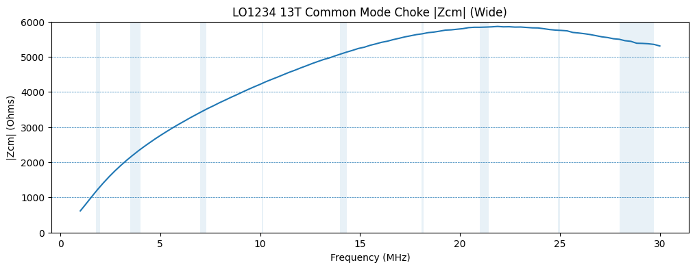
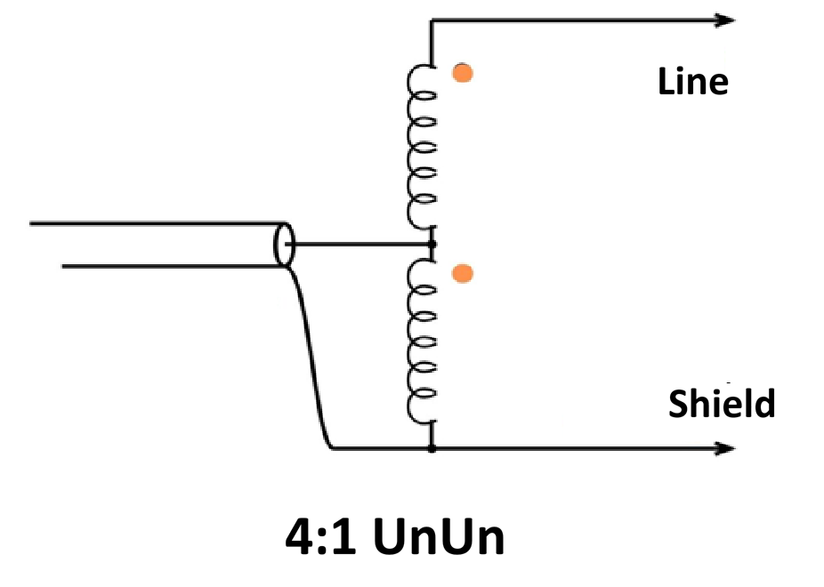
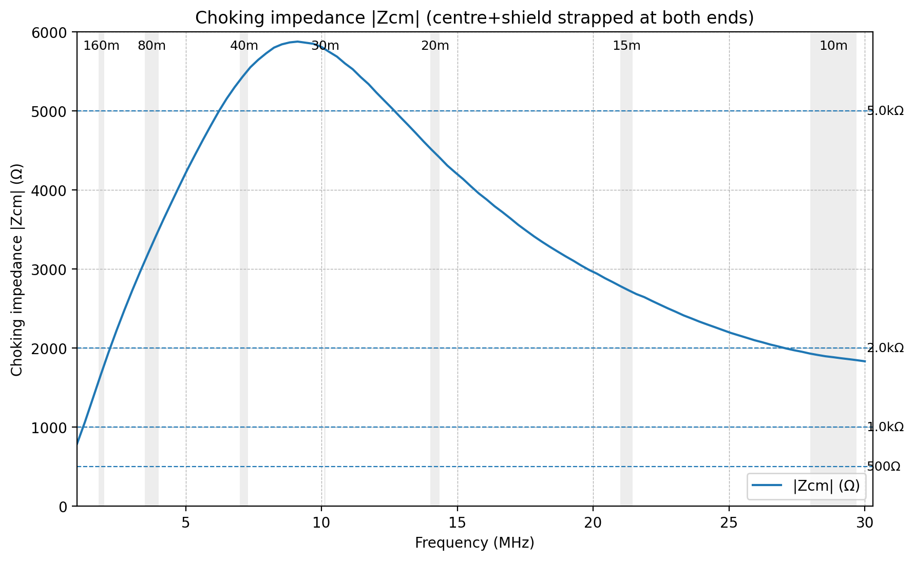

# Building An NKO - New Kallista OCF

There are two options - build suitable NKO UnUn and Baluns from components, or purchase ready made components.

---

## Purchase 100W Range

LDG make a range of low cost UnUn and Balun components suitable for lower power builds.

RU-4:1 Unun - looks to be suitable for the UnUn. The box is marked with an antenna symbol - connect to long arm. The Earth symbol - connect to short arm.

RU-1:1 Unun - may be suitable for the 1:1 current balun at the bottom of the vertical coax. I have not used it or seen its technical specifications.

---

## Build QRP

This is an untested design. Test carefully after building.

_4:1 UnUn_
- Use a Jaycar LO1234 core, or FT110-43
- Wind 7 turns of 0.6mm enamel covered wire, bifilar
- Schematic, same as below for 100W version
- Use connectors and enclosure of choice
- Power handling would be 50w SSB absolute max (untested)

_1:1 Balun_
- Use a Jaycar LO1234 core, or FT110-43
- Wind on 13 turns of 0.6mm enamel covered wire, bifilar
- Use connectors and enclosure of choice
- This has been scanned for choking impedance. See below
- Power handling would be 50w SSB absolute max (untested). On 80m, limit to 25w with NKO (NKO will have highest common mode current on 80m)

Performance; Here is the scan of 13 turns on a single LO1234 core. 

_Should I use Teflon sleeving?_ Teflon sleeving is great for voltage withstand and also to prevent damage to the enamel coating when winding the core. For low power the voltages are lower and Teflon sleeving is not technically required. I've run 100W into 1:1 baluns without teflon sleeving. The 4:1 may have higher voltages as a result of not being 50 ohms, so it makes more sense to sleeve that. 

_Why that power rating?_ The wire is 0.6mm which might be ok for a not recommended 100W. The issue though is the common mode current in the 1:1 on 80m is expected to be highest. This may lead to more heating than a single core of this type could withstand. It might get quite hot.

---

## Build 100W range

These are quite easy to make so long as you are comfortable winding toroids, soldering, and have appropriate skills in packaging into a suitable enclosure. I have successfully built them into "jiffy" style boxes as well as better-sealed enclosures. 

These have been made and measured with a VNA, and the 100W builds are the designs used by the test stations.

### Build 4:1 UnUn

This is made with
- Ferrite core : a single FT140-43 or Jaycar LO1238 toroid
- Wire : Use 2 x 750mm lengths of 0.8mm enamel wire sleeved in teflon tube, held close together as a bifilar pair by small short pieces of plastic tubing.
- Wind 7 turns (so the bifilar pair goes through the hole 7 times)
- Connect as per diagram below

Note: I have used 6 turns for 80m builds. Later, 7 turns tested as slightly lower loss. For 160m builds we suggest 8 turns.

Performance; VNA scans indicate low loss, approx 0.1dB across HF, and with a 200R resistor, excellent impedance transformation across HF.

Here is the schematic; 

### Build 1:1 Balun

This component must have a high choking impedance and also be able to handle the common mode curent in the system. The good news, this is is quite easy to make for a 100W class UnUn.

This is made with
- Use a 4 stack of LO1234 toroids from Jaycar, or a 4 stack of FT110-43's
- Use RG316 coax and wind on 7 turns
- Terminate in LO239 connectors at each end.

Performance; here is the VNA scan of my LO1234 build; 

I used a 4 stack of toroids to get a greater mass to handle more heating. Then reduced the turns count to 7 to account for the increased impedance the 4 stack produced. Adding more turns is easy, but it shifts the self resonance point down in frequency and adversely affects the 10m band.

---

## Build 400W range

For the 4:1 UnUn, substitute a stacked pair of FT140-43 toroids (or Jaycar LO1238's) and use 1mm enamel covered wire sleeved in teflon tubing.

For the 1:1 Balun, substitute a 4 stack of FT140-43 toroids (or Jaycar LO1238's). The choking impedance will be slightly higher but the larger toroids will increase its ability to absorb the higher power (heat).

---

## Purchase QRO - 1,500W range

We can only recommend components that look suitable to handle this level of power. We have not tested these, only read their published data. The 4:1 UnUn and 1:1 Balun specifications of the devices should handle QRO power with ease. The 4:1 is way over-specced.

https://www.balundesigns.com/

Balun Designs Model 4134 - 4:1 Unun 1.5 - 54MHz – 5kW

Balun Designs Model 1115di - 1:1 Dual Core Isolation Balun Dual SO239, 3.5-54 Mhz, 5kW