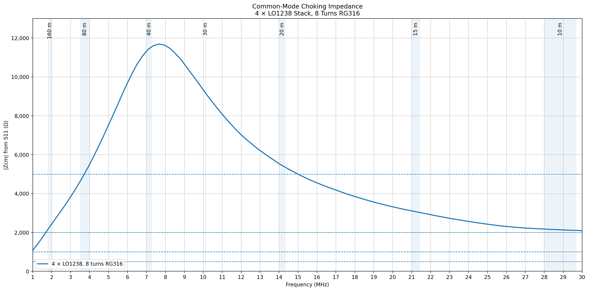

# Building an NKO – New Kallista OCF

This document is the practical build note for the NKO.

There are two broad approaches:

1. **Purchase suitable parts** and assemble the antenna quickly
2. **Build the magnetic parts yourself** and package them as you prefer

The build examples here are the ones used in the early NKO testing. They are practical starting points, not the only possible builds.

Testing methods and results for some 4:1 builds are avainable [here](./NKO_UnUn_Testing.md)

---

## Purchase option — lower power

LDG make low-cost parts that appear suitable for modest-power NKO builds.

### Candidate parts

- **RU-4:1 Unun** — suitable in principle for the apex UnUn  
  - connect the terminal marked for the antenna to the long arm
  - connect the earth/shield side to the short arm and coax shield side of the NKO arrangement

- **RU-1:1** — may be suitable as the lower 1:1 choke  
  - I have not personally characterised it
  - use with care and test thoroughly before relying on it

---

## Build option — QRP

This version is a reasonable starting point for low-power experimental builds. It has been tested with 50W of key down RF at 7mHz for 5 minutes (see separate test results) and performs very well. It has not been tested in the field yet.

### 4:1 UnUn

- Jaycar **LO1234** or **FT110-43**
- 7 turns bifilar
- 0.6 mm enamel wire, sleeved in teflon tube
- enclosure and connectors to suit your build

**Suggested limit:** around **50 W SSB maximum**, and that is still a cautious experimental figure taking into account the antenna imbalance and real world impedances.

### 1:1 choke

- Jaycar **LO1234** or **FT110-43**
- 13 turns bifilar
- 0.6 mm enamel wire
- package as convenient

This version has been scanned for choking impedance.

**Suggested limit:** around **50 W SSB absolute maximum**, but for 80 m NKO use I would stay conservative. On 80 m the common-mode current in the lower choke is expected to be highest.

### Performance example

Scan of 13 turns on a single LO1234 core:

### Teflon sleeving?

At low power it is not strictly necessary, but it is still a good idea. It improves voltage withstand and protects the enamel while winding. The 4:1 UnUn is the part where sleeving makes the most sense.

---

## Build option — around 100 W

These are the parts and winding details used by the early external test stations.

### 4:1 UnUn

Use:

- **1 × FT140-43** or **Jaycar LO1238**
- **2 × 800 mm** lengths of **0.8 mm enamel wire**
- sleeve both wires in PTFE and hold them together as a bifilar pair
- wind **7 turns**

Connect as shown below:

### Notes

- I have also used **6 turns** on 80 m builds
- later testing suggested **7 turns** is slightly better overall
- for 160 m work, **8 turns** is a sensible starting point

VNA checks indicate low loss and good behaviour around a 200 Ω load across HF. Subsequent tests with a 200R dummy load and monitoring heating indicate low loss.

### 1:1 boundary choke

Use:

- **4 stacked Jaycar LO1234** toroids, or **4 × FT110-43**
- **RG316 coax**
- **7 turns**
- terminate in SO239 or other suitable connectors

Example scan:

### Notes

- the four-core stack gives more ferrite mass to absorb heat
- reducing the turns count to 7 keeps the self-resonance high enough for 10 m
- more turns are easy to add, but they also pull the upper-frequency behaviour down

---

## Build option — around 400 W

### 4:1 UnUn

- use a **stacked pair of FT140-43** or **Jaycar LO1238**
- use **1 mm enamel wire**
- sleeve it in PTFE (teflon tubing)
- wind **7 turns**

This has been tested on using a 200R dummy load and shows very low loss. See spearate test results.

### 1:1 boundary choke

- use a **4-stack of FT140-43** or **Jaycar LO1238**
- use **8 turns of RG316**

Example scan:

This gives higher choking impedance and more ferrite mass.

---

## Purchase option — QRO / legal-limit class

These are not lab-verified by me. They are listed because their published specifications look suitable.

### Candidate parts

From **Balun Designs**:

- **Model 4134** — 4:1 UnUn, 1.5–54 MHz, 5 kW
- **Model 1115di** — 1:1 dual-core isolation balun, 3.5–54 MHz, 5 kW

Website:  
https://www.balundesigns.com/

---

## Practical build notes

- The **4:1 UnUn** is the impedance-transforming part at the apex
- The lower **1:1 choke** is not optional in the NKO concept
- Keep the lower choke physically at the bottom of the intended vertical section
- Package everything properly for weather, strain, and voltage
- For higher power, worry more about **heating and voltage withstand** than about ferrite “saturation” myths

---

## Final note

The magnetic parts are important, but the NKO only works as intended when the **whole system** is right:

- arm lengths
- apex height
- vertical coax length
- lower choke placement
- feedline routing
- mechanical layout

